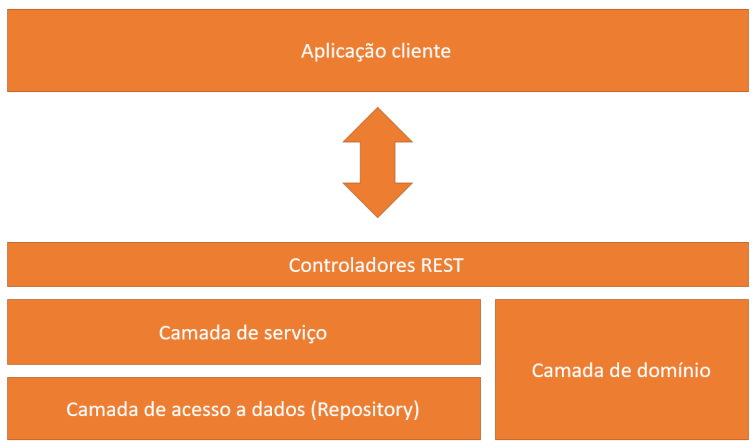
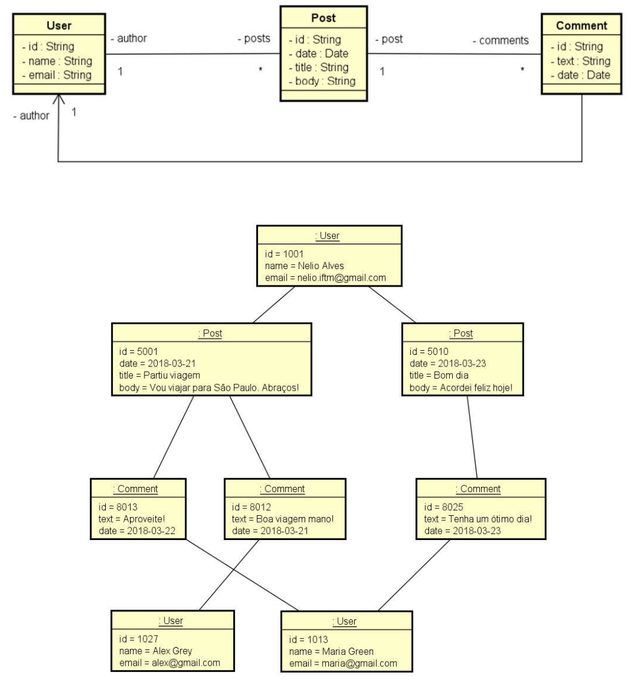
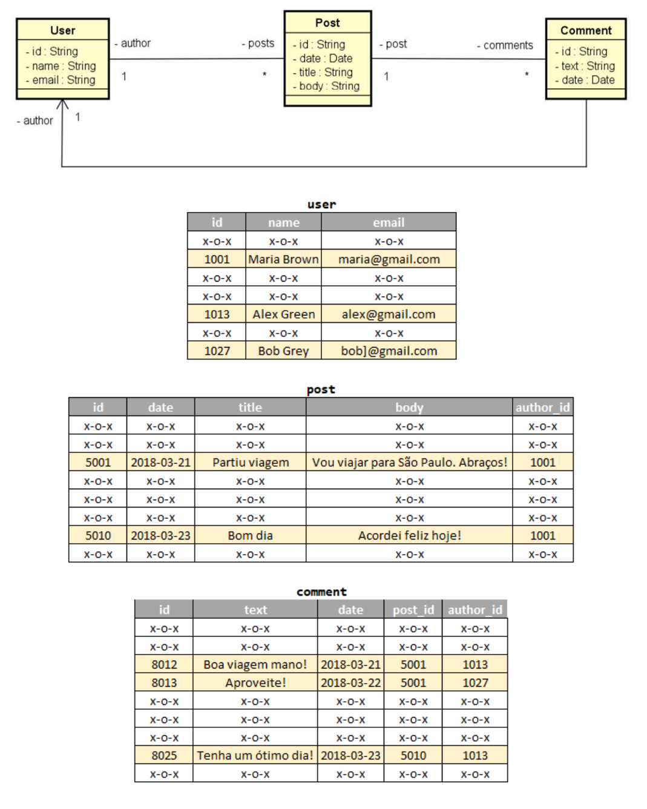
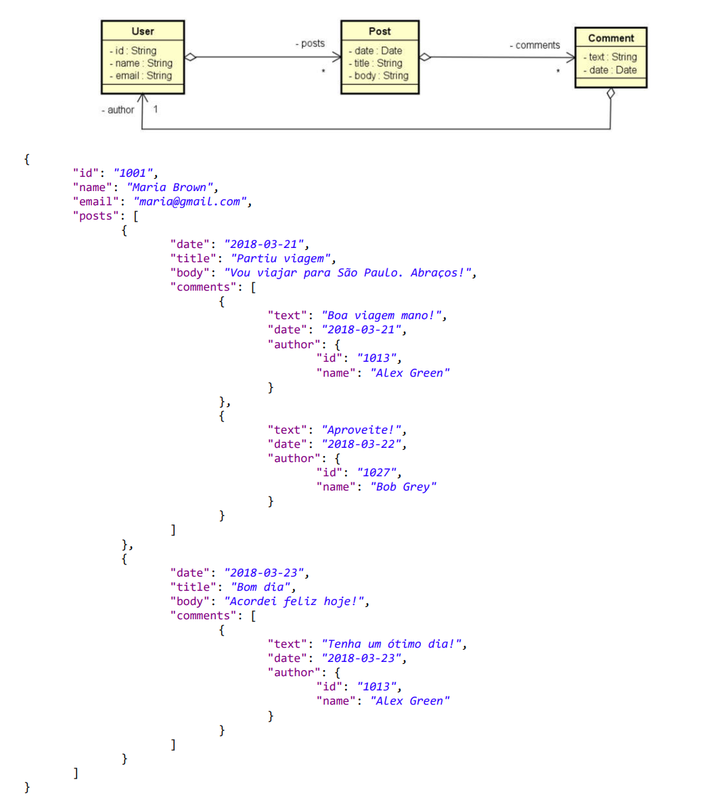
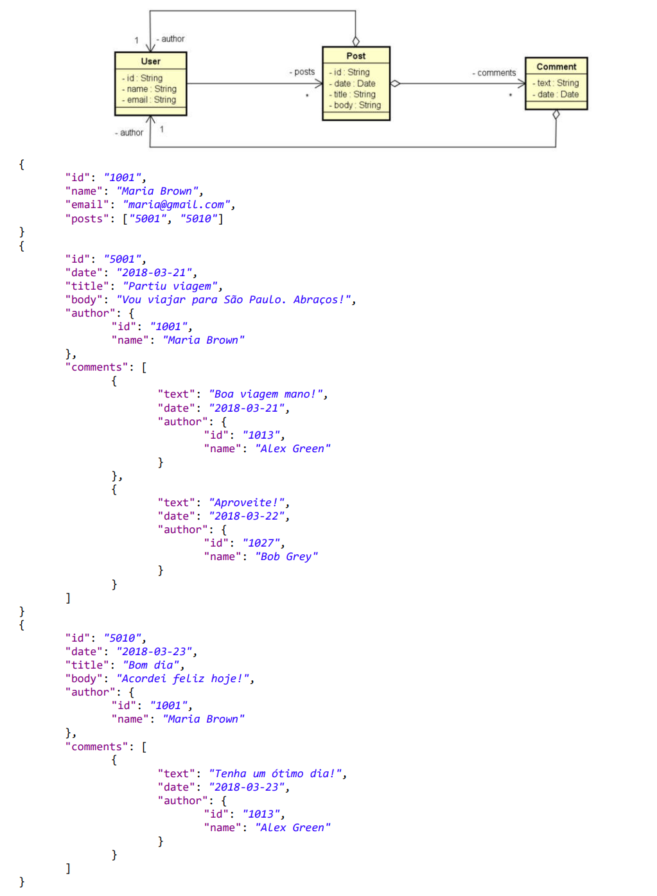

# Projeto MongoDB com Spring Boot

## Sobre o projeto
O projeto trata-se de uma aplicação backend desenvolvida no curso [Java COMPLETO Programação Orientada a Objetos + Projetos](https://www.udemy.com/course/java-curso-completo/).

A aplicação básica consiste em utilizar Spring Boot com Spring Data MongoDB para a persistência de dados em um banco de dados, onde serão armazenadas informações como: usuários, posts e comentãrios.

A aplicação fará operações básicas CRUD: Create, Retrieve, Update e Delete.

O seed de dados será feito através da classe Instantiation e, toda vez que a aplicação for executada, o método deleteAll() do Spring Data fará a exclusão dos dados armazenados na última execução, realizando assim um seed novo de dados.

## Objetivos:
- Implementar operações de CRUD
- Implementar associações entre objetos
- Realizar consultas com Spring Data e MongoRepository

## Tecnologias utilizadas
- Java
- Spring Boot
- Spring Data
- MongoDB
- Maven
- Apace Tomcat
- Postman

## Design System:
O design adotado do sistema backend baseia-se em quatro principais pacotes:

1. Resources: pacote que terão os controladores REST, que farão a comunicação entre a aplicação do cliente com as classes do pacote Services;
2. Services: pacote que terão classes com as business rules, que farão a comunicação com as classes do pacote Repositories;
3. Repositories: pacote que terão as classes responsáveis pelo acesso à base de dados;
4. Entities: pacote que terão as entidades do sistema;

## Discussão a respeito do modelo de domínio
Para o sistema, teríamos o seguinte modelo básico estabelecido:

Da forma arquitetada, um usuário (autor), poderia fazer tanto posts quanto comentários, ficando relacionado conforme mostrado acima.

### Banco de dados relacional
Em um banco de dados relacional, o relacionamento ocorreria através de chaves estrangeiras:

### Banco de dados orientado a agregados (primeira solução)
Em um dados orientado a agregados, como o MongoDB, uma solução de relacionamento ficaria da seguinte forma:

Uma coleçao de usuários tem entidades aninhadas (posts, comentários e autores de comentários) dentro da coleção de usuários.
Esse design é viável apenas quando os usuários tiverem um numero razoavelmente pequeno de posts, pois está tudo aninhado com a coleção usuários. 

Nota: no diagrama, é apresentado como relação de agregação entre todas as entidades. Porém, considerando uma relação de agregação em que o todo e a parte possam ser separados, esse conceito aplica-se somente em posts, que podem NÃO TER comentários.
De resto, não existe um post sem user ou um comentário sem user.

### Banco de dados orientado a agregados (segunda solução)
Uma outra solução de design seria:

Cada usuário é uma coleção a parte e possui uma lista de posts.
Uma segunda coleção, de posts, é implementada no banco de dados, que terão entidades aninhadas (autor, comentários e autor dos comentários).

Nota: mais uma vez, a notação de agregação aplica-se somente em posts, que podem NÃO TER comentários.

### Conclusão:
Conforme necessidade, se os objetos relacionados possui uma grande importancia, lista;
Porém, se os objetos forem simples ou se a necessidade de acessar todo mundo junto for frequente, aninhado.

Para este projeto, foi adotada a segunda abordagem.

# Autor
Thiago Sano

https://www.linkedin.com/in/thiago-sano